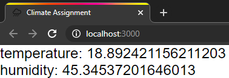

# React Hands-on Workshop

Your task is to create a climate measurement device which has an interface
similar to the following tool:

## Installation

### Prerequisites

You need [Node.js](https://nodejs.org) (version ≥ 10.x required, latest LTS
recommended) to be able to run this project.

You can use the editor/IDE of your choice, but when in doubt, we recommend
[Visual Studio Code](https://code.visualstudio.com/).

### Getting Started

1. Clone this repository
2. Install the dependencies: `npm install` / `yarn`
3. Execute `npm start` / `yarn start` to start the application stub

This should compile the app and open a browser, resulting in something like
this:

The values should be changing over time.

### Running Tests

Use `npm test` to run the tests.

This should initially show you exactly one (purposefully) failing test case.

---

## Assignments

When everything is up and running, move on to the [assignments](assignments.md).
