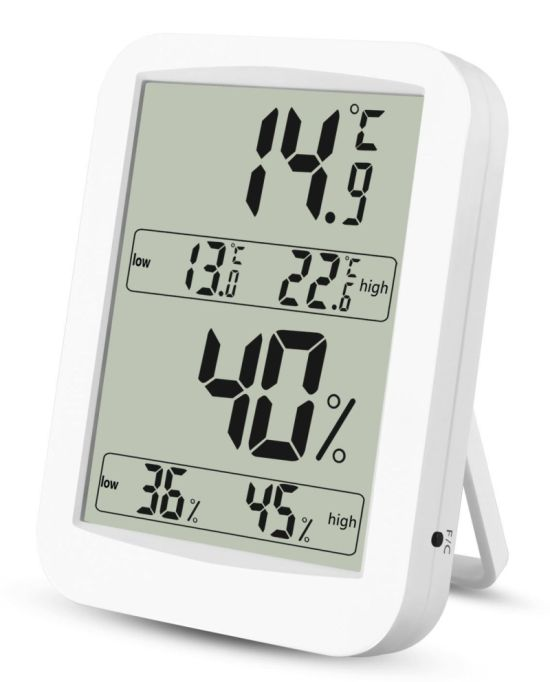
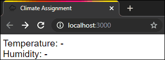

# React Hands-on Workshop

Your task is to create a climate measurement device which has an interface
similar to the following tool:



## Installation

### Prerequisites

You need [Node.js](https://nodejs.org) (version ≥ 10.x required, latest LTS
recommended) to be able to run this project.

> *Note:* If you don't have Node.js yet, make sure to restart any shells or your
> IDE after the Node.js installer has finished, so that the newly installed
> `npm` command is found by them.

You can use the editor/IDE of your choice, but when in doubt, we recommend
[Visual Studio Code](https://code.visualstudio.com/).

### Getting Started

1. Clone this repository
2. Install the dependencies: `npm install`
3. Use `npm start` to start the application stub

This compiles the app and opens a browser, resulting in something like this:



The values should be changing over time.

### Running Tests

Use `npm test` to run the tests.

By default only tests for changed files are run. This is very convenient for
development, but for a initial check press `a` to trigger a full test run.

This should show you exactly one succeeding test case:

```text
✓ Climate app shows the current temperature (example usage of test sensor)
```

You can then quit the test runner with `q` for now.

---

## Assignments

1. [React Component Tree](assignment-1.md)
2. [Render Dynamic Data](assignment-2.md)
3. [Testing React Apps](assignment-3.md)
4. [Application State with Redux](assignment-4.md)
5. [Redux Toolkit](assignment-5.md)
6. [Side Effects with Redux Thunk](assignment-6.md)
